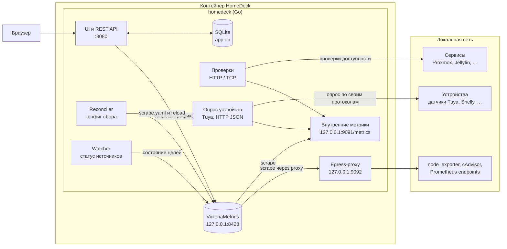
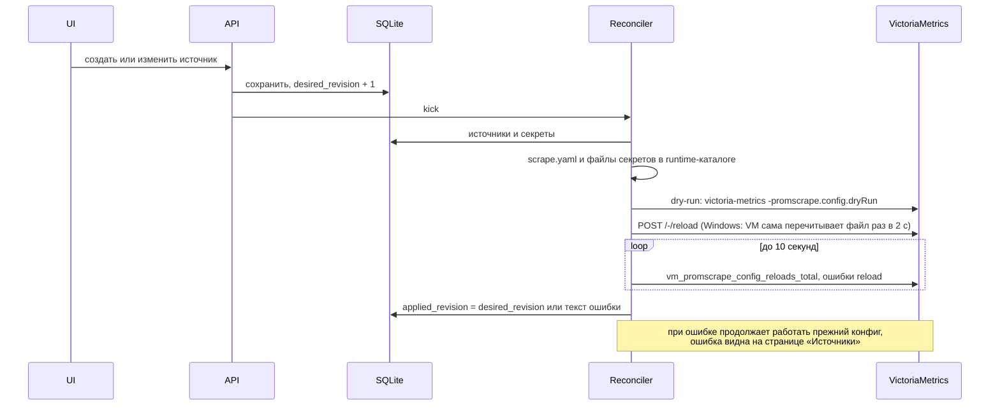

# HomeDeck

Домашняя панель со ссылками, виджетами и мониторингом homelab в одном контейнере: сервисы и их доступность, метрики узлов и контейнеров, датчики и другие устройства со своим API.

- [Техническое задание](docs/homedeck-spec.md)
- [Эксплуатация: запуск, backup, обновление](docs/operations.md)
- [API: OpenAPI 3.1](docs/openapi.yaml)

Стек: Go, VictoriaMetrics single-node, SQLite, Vue 3 + TypeScript. UI встраивается в Go-бинарник, VictoriaMetrics работает дочерним процессом внутри того же контейнера.

## Запуск

В Docker:

```sh
mkdir -p data && sudo chown 1000:1000 data
docker compose up -d --build
docker compose exec homedeck homedeck setup-token
```

Локально без Docker (Linux, macOS, Windows), нужен [just](https://github.com/casey/just):

```sh
just run               # собирает UI и Go, скачивает VictoriaMetrics в .bin/, данные в ./data
just test              # go test -race + vitest
just test-integration  # тесты с настоящей VictoriaMetrics
just lint
```

При запуске в терминале HomeDeck печатает ссылки на UI и setup-token для первого входа.

## Архитектура

Один контейнер, один главный процесс `homedeck` и дочерний процесс VictoriaMetrics. Наружу открыт только порт 8080, остальные слушают `127.0.0.1`.



- **Настройки** (страницы, сервисы, источники, устройства, пресеты запросов, пользователи) живут в SQLite. Изменение источника или секрета повышает `desired_revision`, и reconciler пересобирает конфиг сбора для VictoriaMetrics.
- **Все исходящие соединения** — проверки, опрос устройств, scrape источников — проходят одну сетевую политику: запрещены loopback, link-local, multicast и адреса облачных метаданных, redirects выключены.
- **Секреты** (пароли, токены, ключи устройств) хранятся в SQLite зашифрованными ключом `secrets.key` и не попадают в экспорт.

## Как собираются метрики

Все метрики оказываются в одной VictoriaMetrics, и у каждого ряда есть метка `source_id`, по которой видно, откуда он пришёл.


- **Внешние источники** VictoriaMetrics опрашивает сама по сгенерированному `scrape.yaml` через egress-proxy HomeDeck. Лимиты: 5000 samples за scrape, 20 000 рядов, 16 MiB ответа.
- **Проверки и устройства** выполняет Go: результаты публикуются на внутреннем `/metrics`, откуда их забирает VictoriaMetrics как системный источник `homedeck`. Недоступное устройство отдаёт только `homedeck_device_up 0`, без старых значений, поэтому на графике виден разрыв, а не застывшее число.
- **Графики и показатели** UI запрашивает через API: виджет хранит id пресета и его переменные (`$source_id`, `$service_id`, `$device_id`), сервер подставляет их в MetricsQL, ограничивает ответ 100 рядами и 1000 точками и объединяет одинаковые запросы.

### Как применяется конфигурация сбора



## Устройства

Устройства — датчики и приборы со своим API, которые не отдают метрики Prometheus. HomeDeck опрашивает их сам и приводит значения к общему виду: `homedeck_device_value{device_id, device, key, unit}`. Известные величины получают общие ключи (`temperature`, `humidity`, `co2`, `pm25`, `formaldehyde`, `battery`…), поэтому встроенные пресеты «Устройство: …» работают для датчиков разных производителей.

| Драйвер | Как опрашивается | Что нужно |
| --- | --- | --- |
| Tuya | Локальный протокол 3.3 / 3.4 / 3.5 на порту 6668, версия определяется автоматически | IP, id устройства и `local_key`; JSON устройства из облака Tuya или `tinytuya wizard` вставляется в форму целиком |
| HTTP JSON | GET по URL, значения по путям вида `meters.0.power` | URL и список полей; при необходимости логин с паролем или токен |

Добавляются на странице «Источники → Устройства». Кнопка «Проверить» опрашивает устройство до сохранения и показывает текущие значения. Точки данных Tuya, которых нет в описании устройства, приходят как `dp_<номер>`.

## Где что хранится

```
data/                        HOMEDECK_DATA_DIR, в Docker — /data
  app.db                     SQLite: настройки, страницы, сервисы, источники, устройства,
                             пользователи, сессии, зашифрованные секреты
  secrets.key                ключ шифрования секретов, без него секреты не расшифровать
  metrics/                   VictoriaMetrics: история всех метрик
  assets/                    загруженные иконки и фоны
  config-revisions/          применённые scrape-конфиги и снимки настроек перед импортом
  setup-token                только до создания администратора
/tmp/homedeck/               HOMEDECK_RUNTIME_DIR, пересоздаётся при старте
  scrape.yaml                конфиг сбора для VictoriaMetrics
  secrets/<source_id>/       пароли и токены источников в файлах 0600
```

Резервная копия — весь каталог данных при остановленном контейнере, см. [эксплуатацию](docs/operations.md#backup-и-восстановление-холодная-копия).

## Код

| Каталог | Содержимое |
| --- | --- |
| `cmd/homedeck` | CLI: `serve`, `healthcheck`, `setup-token`, `version`; заставка и цветные логи в терминале |
| `internal/app` | Сборка процесса, порядок старта и остановки |
| `internal/api` | REST API, сессии, CSRF, публичная страница, раздача UI |
| `internal/store` | SQLite, миграции, атомарные сохранения |
| `internal/tsdb` | Супервизор VictoriaMetrics, scrape-конфиг и reload, клиент запросов с лимитами |
| `internal/probe` | HTTP/TCP-проверки и состояния `unknown/up/down/stale/disabled` |
| `internal/devices` | Драйверы устройств (Tuya, HTTP JSON), циклы опроса, вывод `homedeck_device_*` |
| `internal/netguard` | Политика исходящих соединений и egress-proxy |
| `internal/importer` | Импорт/экспорт HomeDeck YAML и импорт Homer |
| `tools/fetchvm` | Скачивание VictoriaMetrics нужной версии со сверкой sha256 |
| `web` | Vue 3 UI |
