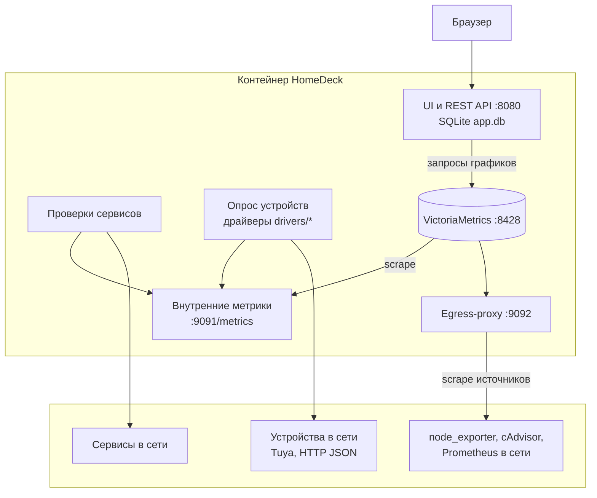
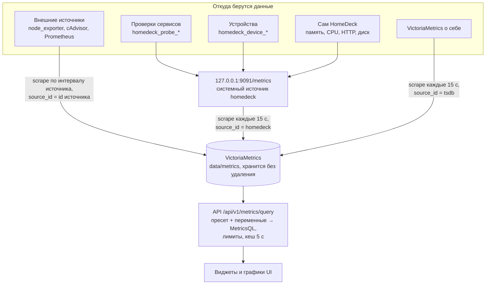
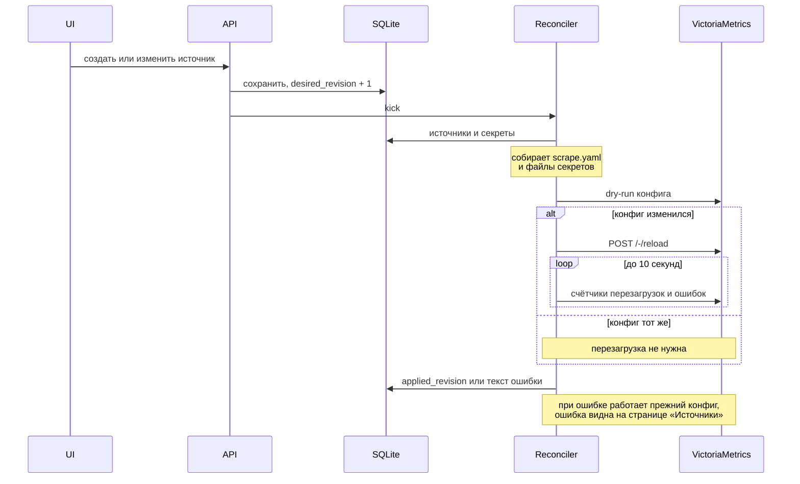
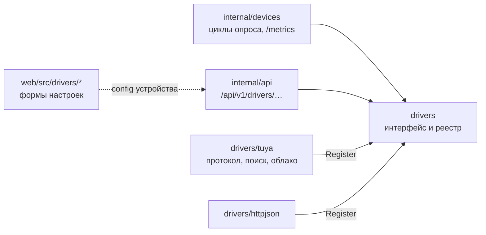

# HomeDeck

Домашняя панель со ссылками, виджетами и мониторингом homelab в одном контейнере: сервисы и их доступность, метрики узлов и контейнеров, датчики и другие устройства со своим API.

- [Техническое задание](docs/homedeck-spec.md)
- [Эксплуатация: запуск, backup, обновление](docs/operations.md)
- [API: OpenAPI 3.1](docs/openapi.yaml)

Стек: Go, VictoriaMetrics single-node, SQLite, Vue 3 + TypeScript. UI встраивается в Go-бинарник, VictoriaMetrics работает дочерним процессом внутри того же контейнера.

## Запуск

В Docker — готовый образ `ghcr.io/fess932/homelab:latest`, его собирает и публикует CI на каждый push в `main` (amd64 и arm64):

```sh
docker compose up -d
docker compose exec homedeck homedeck setup-token
```

Данные лежат в `./data` рядом с `compose.yaml` (другой путь — поменяйте его в `compose.yaml`). Каталог создаётся сам, контейнер работает с правами того, кто его запустил (от root — от root, обычным пользователем в rootless Podman или Docker — от этого пользователя), поэтому достаточно, чтобы у вас было чтение и запись в этот каталог.

Обновление: `docker compose pull && docker compose up -d`. Для фиксированной версии в `compose.yaml` вместо `latest` укажите `sha-<коммит>` или `vX.Y.Z`.

`compose.yaml` по умолчанию включает всё, в том числе поиск устройств: контейнер работает в сети хоста (`network_mode: host`), UI открывается на порту 8080 хоста. Внутренние адреса HomeDeck занимают `127.0.0.1:8428`, `9091`, `9092` на хосте; если они заняты, их можно сдвинуть переменными окружения — примеры в самом файле.

Локально без Docker (Linux, macOS, Windows), нужны Go, [Bun](https://bun.sh) и [just](https://github.com/casey/just); Node.js не нужен:

```sh
just run               # собирает UI и Go, скачивает VictoriaMetrics в .bin/, данные в ./data
just test              # go test -race + vitest
just test-integration  # тесты с настоящей VictoriaMetrics
just lint
```

При запуске в терминале HomeDeck печатает ссылки на UI и setup-token для первого входа.

## Архитектура

Один контейнер, один главный процесс `homedeck` и дочерний процесс VictoriaMetrics. Наружу открыт только порт 8080, остальные слушают `127.0.0.1`.



- **Настройки** (страницы, сервисы, источники, устройства, пресеты запросов, пользователи) живут в SQLite. Изменение источника или секрета повышает `desired_revision`, и reconciler пересобирает конфиг сбора для VictoriaMetrics.
- **Все исходящие соединения** — проверки, опрос устройств, scrape источников — проходят одну сетевую политику: запрещены loopback, link-local, multicast и адреса облачных метаданных, redirects выключены.
- **Секреты** (пароли, токены, ключи устройств) хранятся в SQLite зашифрованными ключом `secrets.key` и не попадают в экспорт.

## Как собираются метрики

Все метрики оказываются в одной VictoriaMetrics, и у каждого ряда есть метка `source_id`, по которой видно, откуда он пришёл.



- **Внешние источники** VictoriaMetrics опрашивает сама по сгенерированному `scrape.yaml` через egress-proxy HomeDeck. Лимиты: 5000 samples за scrape, 20 000 рядов, 16 MiB ответа.
- **Проверки и устройства** выполняет Go: результаты публикуются на внутреннем `/metrics`, откуда их забирает VictoriaMetrics как системный источник `homedeck`. Недоступное устройство отдаёт только `homedeck_device_up 0`, без старых значений, поэтому на графике виден разрыв, а не застывшее число.
- **Графики и показатели** UI запрашивает через API: виджет хранит id пресета и его переменные (`$source_id`, `$service_id`, `$device_id`), сервер подставляет их в MetricsQL, ограничивает ответ 100 рядами и 1000 точками и объединяет одинаковые запросы.

### Как применяется конфигурация сбора



## Устройства и драйверы

Устройства — датчики и приборы со своим API, которые не отдают метрики Prometheus. HomeDeck опрашивает их сам через **драйверы** и приводит значения к общему виду: `homedeck_device_value{device_id, device, key, unit}`. Известные величины получают общие ключи (`temperature`, `humidity`, `co2`, `pm25`, `formaldehyde`, `battery`…), поэтому встроенные пресеты «Устройство: …» работают для устройств любых драйверов.

| Драйвер | Как опрашивается | Что умеет ещё |
| --- | --- | --- |
| `drivers/tuya` | Локальный протокол Tuya 3.3 / 3.4 / 3.5 на порту 6668, версия определяется автоматически | Поиск в сети; подключение аккаунта Smart Life по QR-коду, из которого берутся ключи устройств и описание их значений |
| `drivers/httpjson` | GET по URL, значения по путям вида `meters.0.power` | — |

Как добавить устройство Tuya:

1. «Источники → Устройства → Найти устройства».
2. Один раз «Подключить аккаунт Smart Life»: ввести код пользователя из приложения (Я → Настройки → Аккаунт и безопасность → Код пользователя) и отсканировать QR-код в приложении.
3. В списке найденного нажать «Добавить»: адрес придёт из поиска в сети, ключ и описание значений — из аккаунта.

Без аккаунта устройство тоже добавляется: «Настроить» у найденного устройства, затем ключ вручную или вставить JSON устройства (формат облака Tuya или `devices.json` из `tinytuya wizard`).

Облако нужно только при подключении аккаунта и добавлении устройств; опрос идёт по локальной сети. Вход по QR использует тот же API, что интеграция Tuya в Home Assistant, и её публичный идентификатор клиента — своего у HomeDeck нет. Это неофициальное использование, Tuya может его ограничить. Поиск в сети слушает UDP-анонсы устройств (порты 6666, 6667, 7000) и проверяет порт 6668 в подсети; в Docker для этого нужна сеть хоста — она включена в `compose.yaml` по умолчанию; в bridge-сети устройства находятся по порту, но без id.



Новый драйвер — пакет `drivers/<имя>`, который реализует `drivers.Driver` (описание, проверка настроек, опрос), при желании `drivers.Discoverer` и `drivers.AccountProvider`, регистрируется в `init()` и подключается в `drivers/all`. В UI — каталог `web/src/drivers/<имя>` с формой настроек и строка в `web/src/drivers/index.ts`.

## Где что хранится

```
data/                        HOMEDECK_DATA_DIR, в Docker — /data
  app.db                     SQLite: настройки, страницы, сервисы, источники, устройства,
                             пользователи, сессии, зашифрованные секреты
  secrets.key                ключ шифрования секретов, без него секреты не расшифровать
  metrics/                   VictoriaMetrics: история всех метрик
  assets/                    загруженные иконки и фоны
  config-revisions/          применённые scrape-конфиги и снимки настроек перед импортом
  setup-token                только до создания администратора
/tmp/homedeck/               HOMEDECK_RUNTIME_DIR, пересоздаётся при старте
  scrape.yaml                конфиг сбора для VictoriaMetrics
  secrets/<source_id>/       пароли и токены источников в файлах 0600
```

Резервная копия — весь каталог данных при остановленном контейнере, см. [эксплуатацию](docs/operations.md#backup-и-восстановление-холодная-копия).

## Код

| Каталог | Содержимое |
| --- | --- |
| `cmd/homedeck` | CLI: `serve`, `healthcheck`, `setup-token`, `version`; заставка и цветные логи в терминале |
| `internal/app` | Сборка процесса, порядок старта и остановки |
| `internal/api` | REST API, сессии, CSRF, публичная страница, раздача UI |
| `internal/store` | SQLite, миграции, атомарные сохранения |
| `internal/tsdb` | Супервизор VictoriaMetrics, scrape-конфиг и reload, клиент запросов с лимитами |
| `internal/probe` | HTTP/TCP-проверки и состояния `unknown/up/down/stale/disabled` |
| `internal/devices` | Циклы опроса устройств и вывод `homedeck_device_*`; конкретные протоколы — в `drivers` |
| `drivers` | Интерфейс и реестр драйверов устройств; `drivers/tuya`, `drivers/httpjson` |
| `internal/netguard` | Политика исходящих соединений и egress-proxy |
| `internal/importer` | Импорт/экспорт HomeDeck YAML и импорт Homer |
| `tools/fetchvm` | Скачивание VictoriaMetrics нужной версии со сверкой sha256 |
| `web` | Vue 3 UI |
