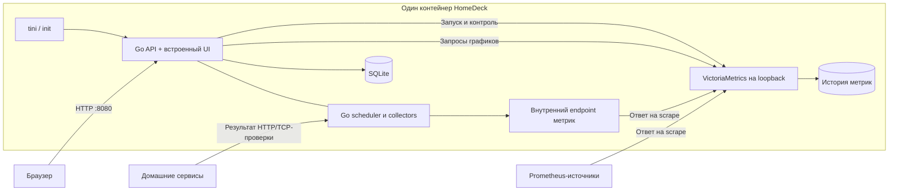

# HomeDeck — техническое задание

Версия: 0.1. Дата: 24 сентября 2026 года. Статус: проект для реализации.

**HomeDeck — домашняя стартовая страница и мониторинг homelab в одном контейнере.** Пользователь открывает одну страницу, видит свои сервисы, их доступность и графики, меняет расположение карточек через UI. Настройки и история переживают обновление контейнера.

Название рабочее. Численные лимиты ниже — проектные требования и цели проверки, а не результаты уже проведённых измерений.

## 1. Задача и границы

Исходные требования: backend на Go, сбор и отображение метрик, настраиваемая домашняя страница со ссылками, поставка одним контейнером. VictoriaMetrics рассматривается как основное хранилище метрик.

Уточнённый пользователем scope: панель и мониторинг. Управление устройствами, Zigbee/Matter, сценарии умного дома и замена Home Assistant в это ТЗ не входят. Точный исходный продукт под названием «home manager» не указан; совместимость с ним не обещается.

Целевая установка: один дом или homelab, один владелец, до 5 одновременно открытых браузеров, 1–20 узлов, до 50 источников метрик, до 100 проверок доступности и до 200 ссылок. Основная платформа — Linux, архитектуры amd64 и arm64.

«Один контейнер» означает один образ и один запущенный контейнер самого HomeDeck, один внешний HTTP-порт и один обязательный каталог данных. Внутри разрешены несколько процессов. Внешняя БД, Grafana, Redis и отдельный контейнер сборщика для работы продукта не требуются.

Метрики удалённого компьютера требуют доступного API или экспортера на этом компьютере. HomeDeck не получает CPU/RAM чужих машин только по их IP. Такие источники относятся к наблюдаемой инфраструктуре. Без них приложение всё равно показывает ссылки, результаты HTTP/TCP-проверок и собственные метрики.

## 2. Ориентиры интерфейса

| Проект | Что полезно взять | Решение для HomeDeck |
| --- | --- | --- |
| [Homer](https://github.com/bastienwirtz/homer) | Группы ссылок, поиск, темы, YAML-конфигурация | Сохранить лёгкую стартовую страницу и переносимость настроек |
| [Homepage](https://gethomepage.dev/) | Карточки с данными сервисов, каталог интеграций, настройка через YAML | Связывать сервис, проверку доступности и метрики в одной карточке |
| [Homarr](https://github.com/homarr-labs/homarr) | Настройка через UI, drag-and-drop, встроенная аутентификация | Сделать визуальный редактор основным способом настройки |

Рекомендация: Homarr — более близкий ориентир для редактирования страницы, Homepage — для содержания карточек. Это оценка применительно к данной задаче. Homer остаётся ориентиром по простоте. Копирование исходного кода этих проектов не требуется.

HomeDeck объединяет стартовую страницу, историю метрик и диагностику источников в собственном UI. Начальный экран должен быть полезен сразу после добавления нескольких ссылок, без знания языка запросов.

## 3. Выбор стека

| Слой | Решение | Назначение |
| --- | --- | --- |
| Backend | Go, стандартный HTTP-сервер | API, авторизация, настройки, проверки сервисов, управление процессом TSDB |
| Метрики | VictoriaMetrics single-node, Community | Сбор Prometheus-метрик, хранение рядов, вычисление запросов |
| Настройки | SQLite | Страницы, карточки, источники, пользователи, секреты, версии конфигурации |
| UI | Vue 3 + TypeScript | Стартовая страница, редактор, мониторинг и настройки |
| Графики | Apache ECharts | Линейные графики, sparklines, интерактивный выбор периода |
| Поставка | Docker/OCI, multi-stage build | Один runtime-образ для amd64 и arm64 |
| Контракты | REST JSON + OpenAPI, версионированный YAML | API и перенос настроек |

Vue подходит для компонентного интерактивного UI; собранные статические файлы включаются через `go:embed`. Для сборки и тестов UI нужен только Bun, Node.js не требуется. Возможности библиотек: [Vue](https://vuejs.org/guide/introduction.html), [ECharts](https://echarts.apache.org/en/index.html), [Go embed](https://pkg.go.dev/embed).

### Почему оставить VictoriaMetrics

Single-node VictoriaMetrics поставляется отдельным исполняемым файлом, умеет опрашивать Prometheus-источники и предоставляет API запросов. Поэтому её можно включить в образ и использовать без отдельного vmagent. Метрики хранятся в `/data/metrics`; стартовый retention — 30 дней. [Документация VictoriaMetrics](https://docs.victoriametrics.com/victoriametrics/single-server-victoriametrics/).

Для этой задачи не вижу причины заменять её по умолчанию. Выбор основан на устройстве поставки и доступных интерфейсах; преимущество по RAM, CPU и размеру данных необходимо проверить на наших профилях нагрузки.

| Альтернатива | Когда имеет смысл | Решение |
| --- | --- | --- |
| Prometheus | Нужны прежде всего его штатные правила и привычная эксплуатация | Рабочая альтернатива; тоже может работать вторым процессом в одном контейнере |
| SQLite для всех данных | Только несколько фиксированных показателей и короткая история | Не выбирать для произвольных рядов: пришлось бы разрабатывать временные агрегации и модель labels |
| Встраивание TSDB как Go-библиотеки | Возникает жёсткое требование одного процесса | Отдельное архитектурное исследование; для текущего требования избыточно |

Prometheus имеет собственную локальную TSDB и параметры хранения по времени и размеру. Его single-node-хранилище также требует резервного копирования. [Документация Prometheus](https://prometheus.io/docs/prometheus/latest/storage/).

SQLite используется только для прикладных сущностей. На MVP не вводить переключение между несколькими TSDB: backend должен иметь небольшой внутренний интерфейс запросов, но реализуется только адаптер VictoriaMetrics.

## 4. Архитектура одного контейнера



Порты: `0.0.0.0:8080` — UI и API; `127.0.0.1:8428` — TSDB; `127.0.0.1:9091` — внутренние метрики и collectors. Наружу публикуется только 8080. Браузер обращается только к Go API.

Go запускает бинарник VictoriaMetrics как дочерний процесс через `os/exec`, передаёт аргументы без shell и контролирует его завершение. TSDB не встраивается через внутренние Go-пакеты upstream. Init-процесс отвечает за доставку сигналов и сбор завершившихся дочерних процессов.

Последовательность старта: проверка прав на `/data`, блокировка единственного экземпляра, миграции SQLite, подготовка конфигурации сбора, запуск внутреннего endpoint и TSDB, запуск API. Во время прогрева UI доступен с состоянием «мониторинг запускается».

При падении TSDB Go продолжает отдавать ссылки и настройки, показывает ошибку мониторинга и пытается перезапустить TSDB с задержками 1, 2, 4, 8, затем 16 секунд. После 5 неудачных запусков подряд контейнер завершается с ошибкой; дальнейший restart выполняет Docker. После минуты стабильной работы счётчик сбрасывается. Повреждение SQLite останавливает обычный запуск с понятной диагностикой.

При остановке Go прекращает новые фоновые задания, завершает текущие запросы, корректно останавливает VictoriaMetrics, закрывает SQLite и выходит. Бюджет остановки контейнера — 60 секунд. Все логи направляются в stdout/stderr с указанием компонента.

## 5. Функциональные требования MVP

### 5.1. Главная страница

| ID | Требование |
| --- | --- |
| HOME-01 | Несколько страниц: например «Дом», «Лаборатория», «Медиа»; выбор стартовой |
| HOME-02 | Группы сервисов, порядок групп и карточек, поиск по названию и тегам |
| HOME-03 | Карточка: название, описание, ссылка, локальная иконка, теги, способ открытия ссылки |
| HOME-04 | Необязательные индикатор доступности, задержка и краткий показатель с мини-графиком |
| HOME-05 | Редактирование формами, перемещение мышью и кнопками, изменение размеров виджетов |
| HOME-06 | Черновик страницы, предпросмотр, явное сохранение и отмена; изменения атомарны |
| HOME-07 | Светлая/тёмная/системная тема, акцент, фон, плотность, число колонок, заголовок и логотип |
| HOME-08 | Адаптивная сетка для телефона и десктопа; отдельные порядок/размеры по breakpoint |
| HOME-09 | Виджеты: ссылка, группа ссылок, часы, текстовая заметка, число, график, статус сервиса |
| HOME-10 | Настройки страницы хранятся на сервере и одинаковы после входа с другого устройства |

Сетка: 12 колонок на широком экране, 6 на планшете, 1 на телефоне; для каждого виджета заданы минимальные размеры. Ошибка одного виджета не ломает страницу. Заметки поддерживают ограниченный Markdown без HTML. Произвольные JS, HTML, CSS и iframe в MVP не поддерживаются; оформление задаётся параметрами темы.

Иконки и шрифты поставляются локально; фоны можно загрузить. Внешние CDN не требуются. Доступность сервиса проверяется отдельно от перехода по ссылке: URL для браузера и адрес проверки могут различаться.

### 5.2. Источники и сбор метрик

| Источник | MVP | Способ подключения |
| --- | --- | --- |
| Сам HomeDeck и TSDB | Да, по умолчанию | Внутренние endpoint: процесс, запросы, сбор, состояние хранилища |
| Сервис с Prometheus endpoint | Да | URL, интервал, timeout, labels, TLS и ссылка на credentials |
| HTTP/HTTPS-проверка | Да | Go scheduler: код ответа, результат, длительность |
| TCP-проверка | Да | Go scheduler: успешность соединения, длительность |
| Linux-узел | Да, через доступный node_exporter | Шаблон CPU/RAM/disk/network/uptime |
| Контейнеры | Да, через уже доступный cAdvisor/совместимый exporter | Шаблоны ресурсных метрик; требования к labels документируются |
| Чтение метрик хоста прямо из контейнера | После MVP | Отдельный collector с явными mount и поддержкой Linux namespaces |
| Docker discovery, Proxmox, NAS, UPS, роутеры | После MVP | Специализированные адаптеры и mapping данных |

Для мониторинга хоста из контейнера нужны специальные условия доступа. Нельзя выдавать показатели контейнера за показатели физического сервера. В частности, запуск node_exporter в контейнере требует настройки доступа к хосту. [Документация node_exporter](https://github.com/prometheus/node_exporter).

Источник можно создать, проверить, отключить и удалить из UI. Отображаются состояние, время последней попытки, время последнего успеха и диагностическая ошибка без секретов. Удаление источника прекращает сбор; исторические ряды сохраняются до истечения retention.

Сбор внешних метрик выполняет встроенный scraper VictoriaMetrics. Go формирует его конфигурацию из SQLite. Scheduler Go выполняет только HTTP/TCP-проверки; их результаты и служебные метрики доступны на внутреннем endpoint для scrape. Запрос браузера не запускает новый сбор.

Значения по умолчанию: scrape — 15 секунд, timeout — 5 секунд; проверки — раз в 30 секунд, timeout — 5 секунд; максимум 10 одновременных проверок. Интервал источника настраивается в пределах 5–3600 секунд, timeout должен быть меньше интервала. Пропущенное задание не создаёт бесконечную очередь; одинаковые проверки не перекрываются.

Минимальные результаты проверок: `homedeck_probe_success`, `homedeck_probe_duration_seconds`, `homedeck_probe_last_run_timestamp_seconds`, `homedeck_probe_last_success_timestamp_seconds`, `homedeck_probe_http_status_code`. Для TCP последний показатель отсутствует. Условия успеха HTTP настраиваются, default — 200–399, автоматические redirects выключены. TLS проверяется по умолчанию; допускается свой CA.

Стабильные labels: `source_id`, `job`, `instance`, а для проверок — `service_id`. Отображаемые названия, URL с query-параметрами, тексты ошибок и request ID не становятся labels. Внешнему endpoint нельзя переопределять служебный `source_id`; при генерации scrape-конфига метка назначается принудительно.

Стартовый бюджет — 20 000 активных рядов и 5 000 samples за scrape одного источника; превышение лимита источника отклоняет его scrape и даёт понятную ошибку. Пороги общей кардинальности, ограничение размера ответа и лимиты TSDB проверяются на выбранной версии в этапе 0. Неограниченная кардинальность не поддерживается.

### 5.3. Состояния и качество данных

Для проверки сервиса доступны состояния `unknown`, `up`, `down`, `stale`, `disabled`. До первой завершённой проверки — `unknown`; после 3 ошибок подряд — `down`; после 2 успехов подряд — `up`. До достижения порога UI показывает счётчик и прежнее состояние. Если новых результатов нет дольше двух интервалов плюс timeout, состояние становится `stale`, даже если последний результат был успешным.

Доступность endpoint метрик и доступность приложения — разные показатели. `up=1` у scraper не доказывает, что пользовательский сервис работает. На карточке явно указывается, какая проверка определяет её статус.

Графики показывают пробелы при отсутствии данных. Последнее известное значение сопровождается временем измерения; свежесть не определяется только успешностью HTTP-ответа query API. `NaN`, бесконечность и пустой результат отображаются как «нет данных», а не как ноль. При остановке контейнера сбор приостанавливается; восстановить пропущенные pull-измерения задним числом невозможно.

### 5.4. Мониторинг в UI

Экран «Обзор»: число доступных сервисов, проблемные источники, краткие ресурсные показатели подключённых узлов. Экран узла: CPU, RAM, файловые системы, сеть и uptime при наличии соответствующих метрик. Экран сервиса: статус, задержка, история успешности проверок и закреплённые графики.

Периоды: 1 час, 6 часов, 24 часа, 7 дней, 30 дней, произвольный диапазон внутри retention. Обновление открытой страницы — раз в 15 секунд; в скрытой вкладке polling останавливается. Пользователь может поставить обновление на паузу.

Создание графика: выбор готового шаблона или редактор MetricsQL для администратора; настройка единиц, легенды и порогов. Шаблоны фильтруются по стабильным ID. Для стандартных показателей писать запросы не нужно. Совместимость произвольных MetricsQL-запросов с Prometheus не обещается.

API ограничивает запрос: timeout 5 секунд, не более 100 возвращаемых рядов, 1 000 точек на ряд и 10 MiB ответа. `step` вычисляется из диапазона и ширины графика с нижней границей интервала сбора. Лимиты вычисления также задаются на стороне TSDB: обрезка готового ответа сама по себе не ограничивает стоимость запроса.

Одинаковые запросы объединяются и кешируются до 5 секунд. На браузер допускается до 4 запросов графиков одновременно, на приложение — до 8 upstream-запросов. Отмена клиентского запроса передаётся в TSDB. Длинные диапазоны требуют явной агрегации в шаблонах: увеличение `step` не является сохранением всех пиков.

### 5.5. Настройки, импорт и секреты

SQLite — единственный источник истины для редактируемых настроек. YAML используется для импорта/экспорта и первоначальной загрузки. Непрерывная двусторонняя синхронизация файла и UI в MVP не нужна. Параметры запуска — адрес прослушивания, пути, retention — задаются отдельно; UI помечает изменения, требующие перезапуска.

Импорт выполняется в два шага: проверка с предпросмотром изменений и атомарное применение. MVP поддерживает полную замену страниц и источников после подтверждения администратора; перед заменой создаётся ревизия. Ошибка не оставляет частично импортированные объекты. Версия схемы обязательна; неизвестная новая версия отклоняется.

Импорт Homer входит в MVP для названий, групп, ссылок и локальных иконок. Smart cards, custom CSS и другие неподдержанные настройки перечисляются в отчёте. Импорт не должен молча терять поля. Экспорт HomeDeck не содержит секретов, хешей паролей и сессий; полный backup — отдельная операция.

Credentials хранятся отдельно и доступны только серверу. В API/UI выдаются маска и ID секрета. Шифрование at rest — ключом из отдельного файла; default-файл создаётся с правами 0600 в `/data`, альтернативный путь передаётся при запуске. Ключ рядом с БД не защищает от кражи всего volume; backup должен включать ключ или инструкцию по его отдельному сохранению.

Сгенерированный scrape-конфиг и файлы credentials размещаются в приватном runtime-каталоге. Изменения получают `desired_revision`; после проверки, атомарной замены файлов и успешного reload — `applied_revision`. При сбое остаётся последний рабочий конфиг, UI показывает расхождение и ошибку, reconciler повторяет применение. После рестарта конфигурация восстанавливается из SQLite. Механизм проверки и reload закрепляется интеграционным тестом для выбранной версии TSDB.

## 6. Экраны и пользовательский путь

Первый запуск: ввод одноразового setup-token, создание администратора, название панели, выбор темы, добавление ссылок. Token создаётся при первом старте и читается локальной CLI-командой из контейнера; в обычные access-логи не попадает. После создания администратора setup-endpoint закрывается.

Основная навигация: «Главная», «Мониторинг», «Источники», «Настройки». Настройки включают внешний вид, страницы, импорт/экспорт, доступ и диагностику. В MVP один администратор; опциональная публичная стартовая страница показывает только явно опубликованные карточки и показатели. Управление источниками всегда требует входа.

Типовой путь: добавить NAS как ссылку → назначить HTTP-проверку → подключить endpoint метрик, если он есть → выбрать готовые графики → разместить карточку на главной. Отсутствие endpoint не мешает использовать ссылку и проверку доступности.

Интерфейс MVP на русском, все строки вынесены в ресурсы для будущего перевода. Поддерживаются клавиатура, видимый focus, текстовые подписи статусов и ширина 360 px без горизонтальной прокрутки основной страницы.

## 7. Модель данных и API

| Сущность | Основные поля |
| --- | --- |
| Page | id, title, slug, theme, revision, published |
| Group | id, page_id, title, order |
| Service | id, name, description, url, icon_asset_id, tags, check_id |
| Widget | id, page_id, group_id, type, config, layout_by_breakpoint |
| Source | id, kind, endpoint, interval, timeout, labels, secret_id, enabled |
| Check | id, service_id, kind, target, expected_status, interval, timeout |
| QueryPreset | id, title, expression, unit, thresholds |
| Asset | id, media_type, size, checksum, path |
| Secret | id, kind, encrypted_payload, key_version |
| User / Session | id, password_hash / token_hash, expiry |
| ConfigRevision | id, schema_version, created_at, desired_revision, applied_revision |

Метрики и исторические результаты проверок хранятся в TSDB; текущие runtime-состояния — в памяти и вычисляются заново после старта. В SQLite сохраняются настройки и последние диагностические сведения, но не копия временных рядов.

| Endpoint | Назначение |
| --- | --- |
| `POST /api/v1/setup`, `POST /api/v1/login`, `POST /api/v1/logout` | Первичная настройка и сессия |
| `GET/POST /api/v1/pages`, `GET/PUT/DELETE /api/v1/pages/{id}` | Страницы и атомарное сохранение layout |
| `/api/v1/services`, `/api/v1/sources`, `/api/v1/checks` | CRUD сущностей с аналогичными маршрутами `{id}` |
| `POST /api/v1/sources/{id}/test` | Ограниченная проверка соединения без изменения настроек |
| `GET /api/v1/status` | Сводное состояние и свежесть данных |
| `POST /api/v1/metrics/query` | Мгновенный запрос |
| `POST /api/v1/metrics/query-range` | Временной ряд с лимитами |
| `POST /api/v1/assets` | Загрузка иконки или фона |
| `POST /api/v1/import/preview`, `POST /api/v1/import/apply` | Проверка и применение импорта |
| `GET /api/v1/export` | Экспорт без секретов |
| `GET /healthz`, `GET /readyz` | Жив ли backend / готовы ли SQLite, TSDB и конфигурация |

Маршруты метрик доступны администратору. Публичные виджеты запрашиваются отдельным endpoint по ID; сервер выбирает сохранённый запрос и допустимый диапазон. Публичный клиент не передаёт произвольное выражение или URL upstream.

Ошибка API: `code`, `message`, `details`, `request_id`; чувствительные поля вычищаются. Конкурентные записи используют revision/`If-Match`, конфликт возвращает 409. Для импорта выдаётся короткоживущий preview-token, связанный с содержимым файла и исходной ревизией. Изменение базы после preview требует повторного предпросмотра.

## 8. Доступ и эксплуатационные ограничения

Вход обязателен по умолчанию. Пароли хешируются Argon2id; сессии — HttpOnly, SameSite cookies, Secure при HTTPS. Запросы изменения состояния защищаются от CSRF. На login и setup вводится ограничение частоты. Reverse proxy опционален; forwarded headers учитываются только от явно доверенного proxy. Прямая работа по HTTP допустима в доверенной локальной сети.

Запросы к сервисам выполняются сервером. Общий публичный HTTP-proxy отсутствует. Домашние private IP допустимы, но пользовательские источники не могут обращаться к loopback приложения, внутренним портам TSDB и адресам cloud metadata. Проверяется фактический адрес соединения, включая IPv6 и повторное DNS-разрешение. Redirects по умолчанию запрещены. Политика применяется как к Go-проверкам, так и к scrape: на этапе 0 проверить возможности выбранной версии scraper, при необходимости использовать внутренний Go egress-proxy с проверкой адреса назначения для пользовательских источников.

Встроенные loopback-источники создаются системой и не редактируются как пользовательские URL. UI не проксирует административные endpoint TSDB и операции удаления/импорта рядов.

В MVP не монтируется Docker socket. Он даёт широкие полномочия над Docker host; суффикс `:ro` у mount сокета не превращает Docker API в read-only. При будущей интеграции потребуется отдельное решение доступа с allowlist операций. [Docker security](https://docs.docker.com/engine/security/).

Контейнер работает без privileged и с правами того, кто его запустил: в образе нет фиксированного USER, поэтому в rootless Podman и Docker процесс работает от пользователя хоста, в rootful — от root. Для каталога данных достаточно, чтобы у запустившего были чтение и запись. Корневая FS read-only; запись разрешена в `/data` и tmpfs `/tmp`. Все capabilities сняты, кроме `DAC_OVERRIDE` (запись в каталог данных, принадлежащий другому пользователю хоста). Загружаемые PNG/JPEG/WebP проверяются по содержимому и размеру; лимит 5 MiB. Пользовательские SVG в MVP не принимаются. Системные иконки поставляются в проверенном наборе.

## 9. Данные, обновление и backup

```text
/data/
  app.db              # настройки, пользователи, ссылки на секреты
  secrets.key         # если ключ не предоставлен отдельным mount
  assets/             # загруженные иконки и фоны
  metrics/            # данные VictoriaMetrics
  config-revisions/   # предыдущие конфигурации без plaintext-секретов
```

Runtime-файлы находятся в приватном каталоге `/tmp/homedeck`, пересоздаются при старте и не являются резервной копией. Один volume обслуживает ровно один экземпляр HomeDeck. Данные размещаются на локальном диске; кластеризация и HA вне MVP.

Обновление: резервная копия → замена образа с фиксированным тегом/digest → миграции → проверка готовности. Версии Go, UI-зависимостей и VictoriaMetrics фиксируются в сборке. Образ не скачивает исполняемый код при старте. Rollback после несовместимой миграции требует совместимой резервной копии, а не только старого образа.

В MVP обязательна документированная холодная копия: корректно остановить контейнер, скопировать весь `/data` и внешний ключ, затем запустить контейнер. Восстановление выполняется в пустой volume с сохранением владельца и прав. Это обеспечивает согласованную копию без разработки отдельного backup-сервиса.

Горячий backup — следующий этап: согласованная копия SQLite, assets и snapshot TSDB в одном manifest с версиями компонентов. Для TSDB использовать штатные [vmbackup](https://docs.victoriametrics.com/victoriametrics/vmbackup/) и [vmrestore](https://docs.victoriametrics.com/victoriametrics/vmrestore/). Копирование открытых файлов БД обычным `cp` не считается поддержанным backup.

Показываются занятый объём и свободное место. Предупреждение — менее 20% свободного места; критическое состояние — менее 10% или 1 GiB. Защитный порог остановки ingestion настраивается согласованно с лимитами TSDB. Исчерпание диска не должно запускать автоматическое удаление SQLite, assets или произвольных файлов метрик.

Стартовая рекомендация: volume от 10 GiB для малого профиля. Это не гарантия 30 дней при любой кардинальности. На стенде измеряются суточный прирост, churn рядов и запас на обслуживание; требуемый объём рассчитывается по результатам с запасом не менее 30%.

## 10. Поставка

Контракт запуска — `compose.yaml` в корне репозитория. Ключевые решения:

- образ `ghcr.io/<владелец>/<репозиторий>:latest` публикует CI; `sha-<коммит>` и `vX.Y.Z` — фиксированные версии;
- `network_mode: host`: без сети хоста поиск устройств не получает широковещательные анонсы;
- данные — каталог хоста `./data:/data`, он создаётся сам;
- без `user:`: процесс работает с правами запустившего; `read_only`, `tmpfs /tmp`, `cap_drop: ALL` с `DAC_OVERRIDE`, `no-new-privileges`;
- `HOMEDECK_RETENTION: 50y`, `stop_grace_period: 60s`, `mem_limit: 1g`, `cpus: 2.0`, healthcheck через `homedeck healthcheck`.

Init (tini) находится в ENTRYPOINT образа. CLI `healthcheck` проверяет `/readyz`. Статус Docker `unhealthy` сам по себе не перезапускает контейнер: фатальные ошибки завершают главный процесс. Значения ресурсов — стартовая конфигурация для проверки, а не обязательное минимальное потребление.

## 11. Проверяемые нефункциональные требования

Стенд: Linux amd64, 2 vCPU, 2 GiB RAM, локальный SSD; контейнер ограничен 1 GiB RAM и 2 CPU. Малый профиль: 5 000 активных рядов, scrape 15 секунд, 20 проверок, 50 карточек, 5 браузеров. Расширенный профиль: 20 000 рядов, до 50 источников, 100 проверок, 200 карточек. Длительность steady-state проверки — 24 часа; отдельно проверяются запросы по 30-дневной истории.

| Показатель | Цель при малом профиле |
| --- | --- |
| RAM всего контейнера | Не более 512 MiB в установившемся режиме; измерять cgroup working set и peak |
| CPU всего контейнера | Среднее не более 0,25 ядра за 15 минут без тяжёлых ручных запросов |
| Загрузка главной в LAN | p95 менее 2 секунд при холодном браузерном кеше |
| CRUD API | p95 менее 200 ms без учёта загрузки файлов |
| График за 24 часа | p95 менее 1 секунды после прогрева при заданных лимитах ответа |
| Свежесть scrape-метрик в UI | До 40 секунд при scrape 15 секунд, timeout 5 секунд и polling 15 секунд |
| Первый запуск с пустыми данными | Готовность менее 30 секунд на указанном стенде |
| Расширенный профиль | Нет OOM, зависаний и неограниченного роста очередей при лимите 1 GiB |

При отсутствии интернета UI, локальные ассеты, настройки и сбор с доступных LAN-источников продолжают работать. Внешние ссылки и источники показывают соответствующую недоступность. Приложение не отправляет телеметрию без отдельного включения.

## 12. Приёмка

1. Чистая установка запускается одним контейнером; второй сервис БД или сборщика не требуется. Проверено на amd64 и arm64.
2. Пользователь создаёт две страницы, группы, ссылки, заметку и график через UI; меняет тему и расположение, сохраняет, открывает с другого устройства.
3. Собственные метрики появляются без внешних источников. Тестовый Prometheus endpoint подключается через UI; данные отображаются и сохраняются после перезапуска.
4. HTTP- и TCP-проверки переходят между состояниями согласно порогам. Остановка scheduler приводит к `stale`; отсутствие данных не рисуется нулём.
5. Недоступный источник не блокирует остальные; ошибка TLS и timeout имеют различимые сообщения. Источник с избытком samples не исчерпывает память.
6. Некорректный конфиг отклоняется; ошибка reload сохраняет последний рабочий сбор и видна в UI. После рестарта применяется сохранённая desired revision либо остаётся явная диагностическая ошибка.
7. Завершение процесса TSDB вызывает режим деградации и контролируемое восстановление. Ссылки работают во время восстановления.
8. Импорт Homer переносит поддержанные поля и выдаёт отчёт по остальным. Импорт HomeDeck атомарен; round-trip сохраняет настройки, исключая секреты по контракту.
9. Изменения без сессии отклоняются; публичный виджет не позволяет выполнить произвольный запрос. Проверены CSRF, DNS rebinding, redirects и запрет доступа к внутренним endpoint через источники.
10. После остановки контейнера выполняется backup; восстановление в пустой volume возвращает страницы, вход, credentials, ассеты и выбранный исторический диапазон метрик.
11. Проверены нехватка места, SIGTERM, аварийное завершение и несовместимая миграция; нет молчаливого сброса конфигурации. Допустимая потеря последних незафиксированных samples при аварии измерена и отражена в эксплуатационной документации.
12. Выполнены измерения из раздела 11; опубликованы версия образа, параметры стенда, нагрузка, p95 и peak RAM. Невыполненные цели не объявляются достигнутыми.

## 13. Этапы реализации

| Этап | Результат и условие завершения |
| --- | --- |
| 0. Проверка архитектуры | Образ с Go и TSDB, arm64/amd64, старт/stop/restart, scrape/reload, сетевые ограничения, лимиты памяти, один минимальный график; зафиксированы версии |
| 1. Каркас продукта | SQLite и миграции, setup/login, страницы и сервисы, встроенный UI, безопасные uploads |
| 2. Мониторинг | Источники, проверки, состояния, шаблоны node_exporter/cAdvisor, история и query API с лимитами |
| 3. Редактор домашней страницы | Сетка, drag-and-drop, темы, виджеты, мобильный интерфейс, сохранение ревизий |
| 4. Переносимость и выпуск MVP | Импорт/экспорт, импорт Homer, backup/restore, нагрузочная проверка, документация запуска и обновления |

После MVP: Docker discovery, прямой Linux collector, интеграции Proxmox/NAS/UPS, несколько пользователей и роли, уведомления, горячие backups, произвольные пользовательские dashboards. Алертинг проектируется отдельно: текущие индикаторы доступности не являются полноценным движком alert rules.

За рамками текущего продукта: управление питанием и контейнерами, автоматизация умного дома, хранение логов и traces, распределённая TSDB, HA, маркетплейс исполняемых плагинов. Добавление таких функций требует отдельного уточнения требований.
